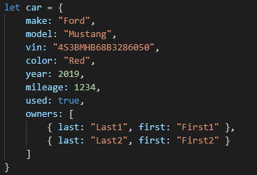
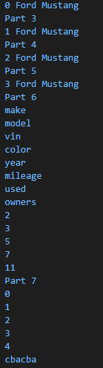

# Welcome to the Cit 281 Lab 3 Page

### What I learned:

- Learned how to destructure an object in javascript.
- Introduction to arrow functions and converting normal functions into arrow functions.
- Using for ..in syntax with objects.
- Importing modules using require.
- Exporting modules using module.exports.

### Purpose of Lab:

- This lab had us work with objects and help us understand them.
- We learned how to output values from objects by destructuring them.
- We were also able to figure out how to create effective loops for objects using for ..in syntax.
- We also got to work with arrow functions and learn how they work, and how to convert normal functions into arrow functions. 

### Outcome pics:

### [**Back to home page**](https://uo-cit-itsbread33.github.io/ItsBread33.github.io/)
